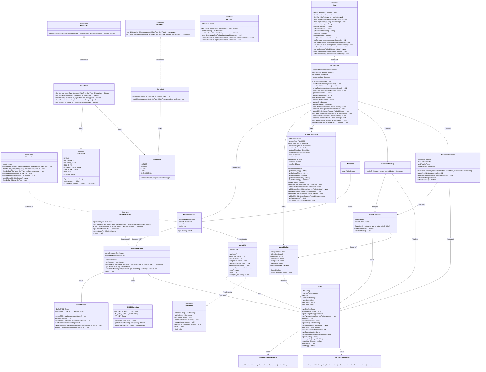

#### Final UML Design

```mermaid
classDiagram

%% === INTERFACES ===
class IController {
  <<interface>>
  + start(): void
  + handleSearch(String: value, Operations: op, FilterType: filterType): void
  + handleFilter(String: filter, String: operator, String: value): void
  + handleSort(FilterType: filterType, boolean: ascending): void
  + handleAddMovie(String: movieTitle): void
  + handleRemoveMovie(String: movieTitle): void
  +handleResetMovieCollection(): void
  + handleSave(String: fileType): void 
}
class IMovieCollection {
  <<interface>>
  +getMovies(): List~Movie~
  +getFilteredMovies(String: value, Operations: op, FilterType: filterType): List~Movie~`
  +getSortedMovies(FilterType: SortType, boolean ascending): List~Movie~`
  +getFilteredMovieList(): List~Movie~
  +getInstance(): IMovieCollection
  +reset(): void
}
class IMovieFilter {
    <<interface>>
    filter(List~Movie~ movieList, Operations: op, FilterType: filterType, String: value) : Stream~Movie~
}
class IMovieList {
  <<interface>>
  +getMovieTitles(): List~String~
  +getMovies(): List~Movie~
  +add(Movie: movie): void
  +addAll(List~Movie~: movies): void
  +remove(Movie: movie): void
  +removeAll(List~Movie~: movies): void
  +clear(): void
  +size(): int
}
class IMovieSort {
    <<interface>>
  +sort(List~Movie~: filteredMovieList, FilterType: filterType): List~Movie~
  +sort(List~Movie~: filteredMovieList, FilterType: filterType, boolean: ascending): List~Movie~
}
class IStorage {
  <<interface>>
  +DATABASE: String
  +readJSON(InputStream: inputStream): List~Movie~
  +loadDatabase(): List~Movie~
  +loadUserSavedMovieList(String: username): List~Movie~
  +appendNewMovieJsonToDatabase(InputStream: in): void
  +writeToUserMovieList(ArrayList~Movie~: movieList, String: username): void
  +writeToUserMovieList(ArrayList~Movie~: movieList): void
}
class IView {
  <<interface>>
  +setVisible(boolean: visible): void
  +viewMovieCollection(List~Movie~: movies): void
  +viewMovieList(List~Movie~: movies): void
  +showErrorMessage(String: errorMessage): void
  +showHelpMessage(String: helpMessage): void
  +getSearchQuery(): String
  +getSelectedFilter(): String
  +getSelectedSort(): String
  +getSelectedOperator(): String
  +getSort(): boolean
  +getNotAscDec(): boolean
  +addFilterListener(ActionListener: listener): void
  +addSortListener(ActionListener: listener): void
  +addAddMovieListener(ActionListener: listener): void
  +addRemoveMovieListener(ActionListener: listener): void
  +addSaveListener(ActionListener: listener): void
  +addHelpListener(ActionListener: listener): void
  +addAddAllListener(ActionListener: listener): void
  +setRemoveAction(Consumer<Movie>: removeAction): void
}


%% === MODELS ===

class Movie {
  -title: String
  -averageRating: double
  -year: int
  -genre: List~String~
  -cast: List~String~
  -description: String
  -imageUrl: String
  +getTitle(): String
  +setTitle(title: String): void
  +getAverageRating(): double
  +setAverageRating(averageRating: double): void
  +getYear(): int
  +setYear(year: int): void
  +getGenre(): List~String~
  +setGenre(genre: List~String~): void
  +getCast(): List~String~
  +setCast(cast: List~String~): void
  +getDescription(): String
  +setDescription(description: String): void
  +getImageUrl(): String
  +setImageUrl(imageUrl: String): void
  +equals(o: Object): boolean
  +hashCode(): int
  +toString(): String
}
class ListOfStringDeserializer{
  +deserialize(JsonParser: jp, DeserializationContext: ctxt): List~String~
}
class ListOfStringSerializer {
    +serialize(ArrayList~String~: list, JsonGenerator: jsonGenerator, SerializerProvider: serializer): void
}
class MovieCollection {
  -movieRecords: Set~Movie~
  -filteredMovieList: List~Movie~
  +MovieCollection()
  +getMovies(): List~Movie~
  +getFilteredMovies(value: String, op: Operations, filterType: FilterType): List~Movie~
  +getFilteredMovieList(): List~Movie~
  +sortFilteredMovies(sortType: FilterType, ascending: boolean): List~Movie~
  +reset(): void
}
class MovieList{
  - movies: Set<Movie>
  +MovieList()
  +getMovieTitles(): List<String>
  +getMovies(): List<Movie>
  +add(movie: Movie): void
  +addAll(movieList: List<Movie>): void
  +remove(movie: Movie): void
  +removeAll(movieList: List<Movie>): void
  +clear(): void
  +size(): int
  +save(fileType: String): void
}

%% === STORAGE / API ===
class MovieStorage {
  - DATABASE: String
  - DEFAULT_OUTPUT_LOCATION: String
  +readJSON(inputStream: InputStream): List<Movie>
  +loadDatabase(): List<Movie>
  +loadUserSavedMovieList(username: String): List<Movie>
  +writeJsonData(movies: Set<Movie>): void
  +writeToUserMovieList(movieList: ArrayList<Movie>, username: String): void
  +writeToUserMovieList(movieList: ArrayList<Movie>): void
}
class OMDBMovieData {
  -API_URL_FORMAT_TITLE: String
  -API_URL_FORMAT_YEAR: String
  -API_KEY: String
  +getApiUrl(String: title): String
  +getUrlContents(String: urlStr): InputStream
  +getMovieDetails(String: title): InputStream
}


%% === CONTROLLER ===
class MovieController {
  -model: IMovieCollection
  -userList: IMovieList
  -view: IView
  -results: List<Movie>
  +getResults(): List<Movie>
}

%% === VIEW ===
class ButtonCommands {
  - addListeners: List<ActionListener>
  - searchField: JTextField
  - filterDropdown: JComboBox<String>
  - operatorDropdown: JComboBox<String>
  - sortDropdown: JComboBox<String>
  - sortAscCheckbox: JCheckBox
  - sortDecCheckbox: JCheckBox
  - filterBtn: JButton
  - sortBtn: JButton
  - addAllBtn: JButton
  - resetBtn: JButton
  - helpBtn: JButton

  +ButtonCommands()
  +getSearchQuery(): String
  +getSelectedFilter(): String
  +getSelectedSort(): String
  +getSelectedOperator(): String
  +isSortAscending(): boolean
  +notAscDec(): boolean
  +addFilterListener(listener: ActionListener): void
  +addSortListener(listener: ActionListener): void
  +addRemoveMovieListener(listener: ActionListener): void
  +addHelpListener(listener: ActionListener): void
  +addAddAllListener(listener: ActionListener): void
  +addAddMovieListener(listener: ActionListener): void
  +getAddListeners(): List<ActionListener>
  +setSearchQuery(query: String): void
}

class JFrameView {
  - userListPanel: UserMovieListPanel
  - buttonPanel: ButtonCommands
  - splitPane: JSplitPane
  - removeAction: Consumer<Movie>
  +JFrameView(movies: List<Movie>)
  +viewMovieCollection(movies: List<Movie>): void
  +viewMovieList(movies: List<Movie>): void
  +showErrorMessage(errorMessage: String): void
  +showHelpMessage(helpMessage: String): void
  +getSearchQuery(): String
  +getSelectedFilter(): String
  +getSelectedSort(): String
  +getSelectedOperator(): String
  +getSort(): boolean
  +getNotAscDec(): boolean
  +addFilterListener(listener: ActionListener): void
  +addSortListener(listener: ActionListener): void
  +addAddMovieListener(listener: ActionListener): void
  +addRemoveMovieListener(listener: ActionListener): void
  +addSaveListener(listener: ActionListener): void
  +addHelpListener(listener: ActionListener): void
  +addAddAllListener(listener: ActionListener): void
  +setRemoveAction(removeAction: Consumer<Movie>): void
}

class MovieCardPanel {
  - movie: Movie
  - actionButton: JButton

  +MovieCardPanel(movie: Movie, buttonLabel: String)
  +getActionButton(): JButton

  -showFullDetails(): void
}

class MovieDisplay {
  - imageLabel: JLabel
  - titleLabel: JLabel
  - yearLabel: JLabel
  - genreLabel: JLabel
  - ratingLabel: JLabel
  - castLabel: JLabel
  - descriptionArea: JTextArea

  +MovieDisplay()
  +setMovie(movie: Movie): void
}

class MovieGridDisplay {
  +MovieGridDisplay(movies: List<Movie>, addAction: Consumer<Movie>)
}

class UserMovieListPanel {
  - saveButton: JButton
  - clearButton: JButton
  - cardPanel: JPanel
  - removeAction: Consumer<Movie>

  +UserMovieListPanel(movies: List<Movie>, buttonLabel: String, removeAction: Consumer<Movie>)
  +updateMovieList(movies: List<Movie>): void
  +setRemoveAction(removeAction: Consumer<Movie>): void
  +getClearButton(): JButton
  +getSaveButton(): JButton
}


%% === UTILITIES ===
class MovieFilter {
  +filter(List<Movie> movieList, Operations op, FilterType filterType, String value): Stream<Movie>
  +filterByTitle(List<Movie> movieList, Operations op, String title): Stream<Movie>
  +filterByGenre(List<Movie> movieList, Operations op, String genre): Stream<Movie>
  +filterByDesc(List<Movie> movieList, Operations op, String desc): Stream<Movie>
  +filterByYear(List<Movie> movieList, Operations op, int value): Stream<Movie>
}

class MovieSort {
+sort(filteredMovieList: List<Movie>, filterType: FilterType): List<Movie>
+sort(filteredMovieList: List<Movie>, filterType: FilterType, ascending: boolean): List<Movie>
}


%% === ENUMS ===
class Operations {
  <<enum>>
  EQUALS
  NOT_EQUALS
  GREATER_THAN
  LESS_THAN
  GREATER_THAN_EQUAL
  LESS_THAN_EQUAL
  CONTAINS
  - operator: String
  +Operations(operator: String)
  +getOperator(): String
  +fromOperator(operator: String): Operations
}

class FilterType{
  <<enum>>
  +GENRE
  +RATING
  +YEAR
  +TITLE
  +DESCRIPTION
  +containsValues(String: value): FilterType
}

class MovieApp {
  +main(String[] args)
}

%% === RELATIONSHIPS ===
IView <|.. JFrameView : implements
MovieApp --> MovieController : "starts"
MovieList o-- Movie : "has"
IMovieCollection <|.. MovieCollection : "implements"
MovieCollection --> MovieStorage : "uses"
MovieCollection --> OMDBMovieData : "uses"
MovieCollection --> Movie : "manages"
MovieList ..|> IMovieList : "implements"
IController <|.. MovieController : "implements"
MovieController --> MovieCollection : "interacts with"
MovieController --> MovieList : "interacts with"
JFrameView --> MovieController : "interacts with"
JFrameView --> MovieDisplay : "uses"
JFrameView --> ButtonCommands : "uses"
JFrameView --> MovieGridDisplay : "displays"
MovieGridDisplay --> MovieCardPanel: "contains"
JFrameView --> UserMovieListPanel : "displays"
Movie --> ListOfStringDeserializer : "uses"
Movie --> ListOfStringSerializer : "uses"
IMovieSort <|.. MovieSort : implements
MovieSort --> FilterType : "uses"
MovieFilter --> Operations : "uses"
IMovieFilter <|.. MovieFilter : implements
MovieFilter --> FilterType : "uses"
MovieCardPanel --> Movie : "uses"
UserMovieListPanel --> MovieCardPanel : "displays"
UserMovieListPanel --> Movie : "manages"
MovieGridDisplay --> Movie : "displays"
MovieDisplay --> Movie : "displays"
MovieCardPanel --> MovieDisplay : "launches"
```