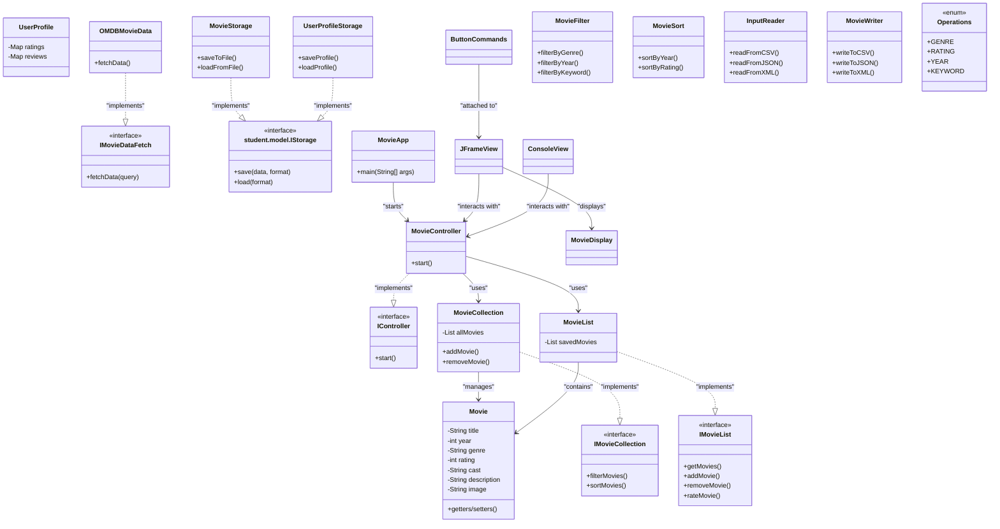

#### Initial UML Design 

```mermaid
classDiagram

%% === INTERFACES ===
class IMovieCollection {
  <<interface>>
  +filterMovies()
  +sortMovies()
}
class IMovieList {
  <<interface>>
  +getMovies()
  +addMovie()
  +removeMovie()
  +rateMovie()
}
class IMovieDataFetch {
  <<interface>>
  +fetchData(query)
}
class student.model.IStorage {
  <<interface>>
  +save(data, format)
  +load(format)
}
class IController {
  <<interface>>
  +start()
}


%% === MODELS ===
class Movie {
  -String title
  -int year
  -String genre
  -int rating
  -String cast
  -String description
  -String image
  +getters/setters()
}
class MovieCollection {
  -List<Movie> allMovies
  +addMovie()
  +removeMovie()
}
class MovieList {
  -List<Movie> savedMovies
}
class UserProfile {
  -Map<Movie, String> ratings
  -Map<Movie, String> reviews
}

%% === STORAGE / API ===
class MovieStorage {
  +saveToFile()
  +loadFromFile()
}
class UserProfileStorage {
  +saveProfile()
  +loadProfile()
}
class OMDBMovieData {
  +fetchData()
}

%% === CONTROLLER ===
class MovieApp {
  +main(String[] args)
}
class MovieController {
  +start()
}

%% === VIEW ===
class JFrameView
class MovieDisplay
class ButtonCommands
class ConsoleView

%% === UTILITIES ===
class MovieFilter {
  +filterByGenre()
  +filterByYear()
  +filterByKeyword()
}
class MovieSort {
  +sortByYear()
  +sortByRating()
}
class InputReader {
  +readFromCSV()
  +readFromJSON()
  +readFromXML()
}
class MovieWriter {
  +writeToCSV()
  +writeToJSON()
  +writeToXML()
}

%% === ENUMS ===
class Operations {
  <<enum>>
  +GENRE
  +RATING
  +YEAR
  +KEYWORD
}

%% === RELATIONSHIPS ===
MovieApp --> MovieController : "starts"
MovieCollection --> Movie : "manages"
MovieList --> Movie : "contains"
MovieCollection ..|> IMovieCollection : "implements"
MovieList ..|> IMovieList : "implements"
OMDBMovieData ..|> IMovieDataFetch : "implements"
MovieStorage ..|> student.model.IStorage : "implements"
UserProfileStorage ..|> student.model.IStorage : "implements"
MovieController ..|> IController : "implements"
MovieController --> MovieCollection : "uses"
MovieController --> MovieList : "uses"
JFrameView --> MovieController : "interacts with"
JFrameView --> MovieDisplay : "displays"
ButtonCommands --> JFrameView : "attached to"
ConsoleView --> MovieController : "interacts with"

```