# GUI Testing History

## GUI Introduction
Here you will find images and descriptions of our GUI testing process. For our view, we implmemted an interface IView. We included a class for the buttons on our GUI, the main JFrame, and 2 JPanel frames. The JPanel Frame on the left is the movie collection and on the right is the user movie list. Each jPanel uses the MovieGridDisplay to display the movie poster and titles in a grid format with a "Add" or "Remove" button beneath.

### Movie Display Card
We first started with creating the movie display card and testing the format. The display card is a pop up frame from the JPanel grid and includes detailed information about the movie such as title, year, genre, rating, cast, and description. Below is an image of the test file and the pop up.  
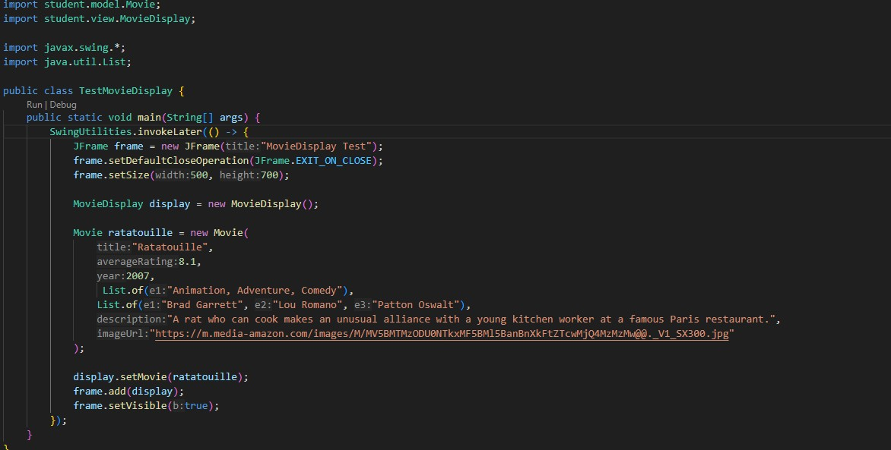
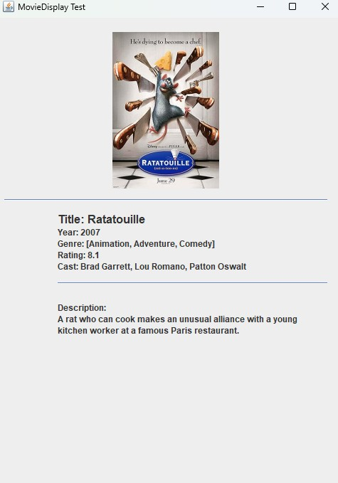

### Movie Card Panel
Next we created and tested the Movie Card Panel which would be how the movies would display to the user next to each other in a grid format with the movie poster and name. If a user clicks the poster the Movie Display Card pops up.  
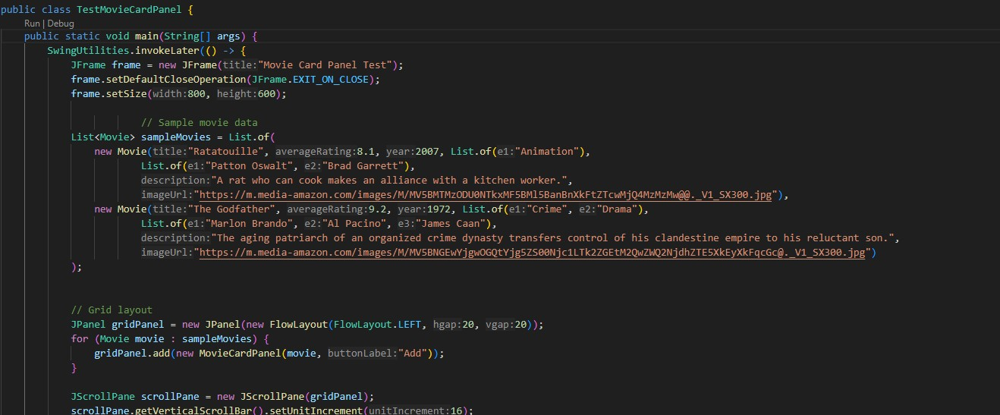
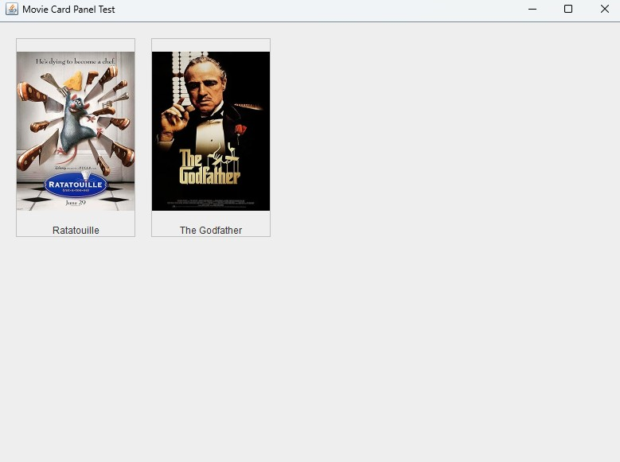

### Initial JFrame and Buttons
Then we created the JFrame to hold the buttons and eventually the other JPanels. The first image is when we tested the JFrame with only the buttons at the top.  
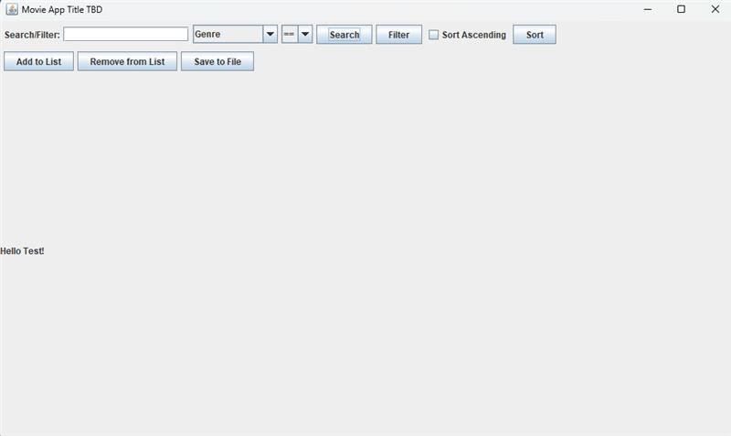
Next we worked on aligning the buttons at the top in 3 rows and centering them. We also tested adding a welcome message to the JFrame which eventually became a popup message after we added the JPanels.  
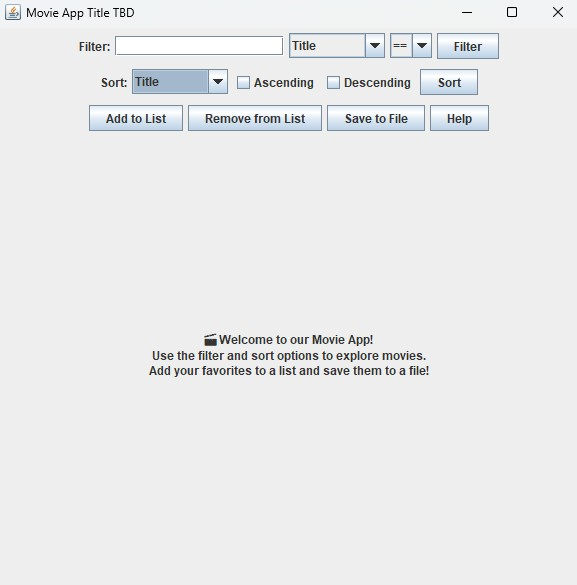
In the JFrame, we added the first JPanel and we tested it with the file below which included 4 sample movies.  
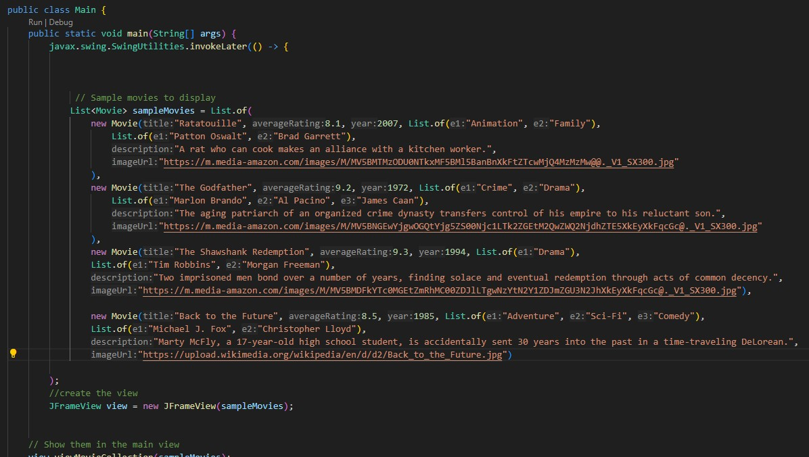
At first we intended to have a the user Movie List to be a pop up, but decided to do a split JPanel with the Movie Collection on the left and the Movie List on the right. The image below shows our group testing the view of the split panel and making sure the movie cards include the add or remove buttons.  
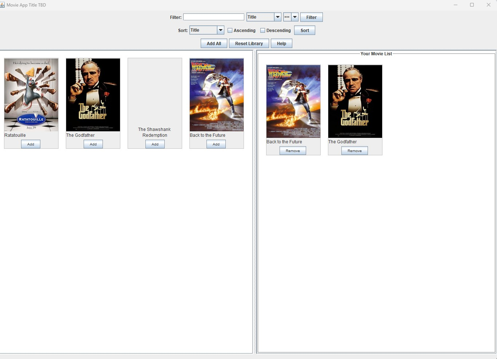
Next we implmented the clear list and save to file buttons on the GUI. We tested if they were visible when run.  
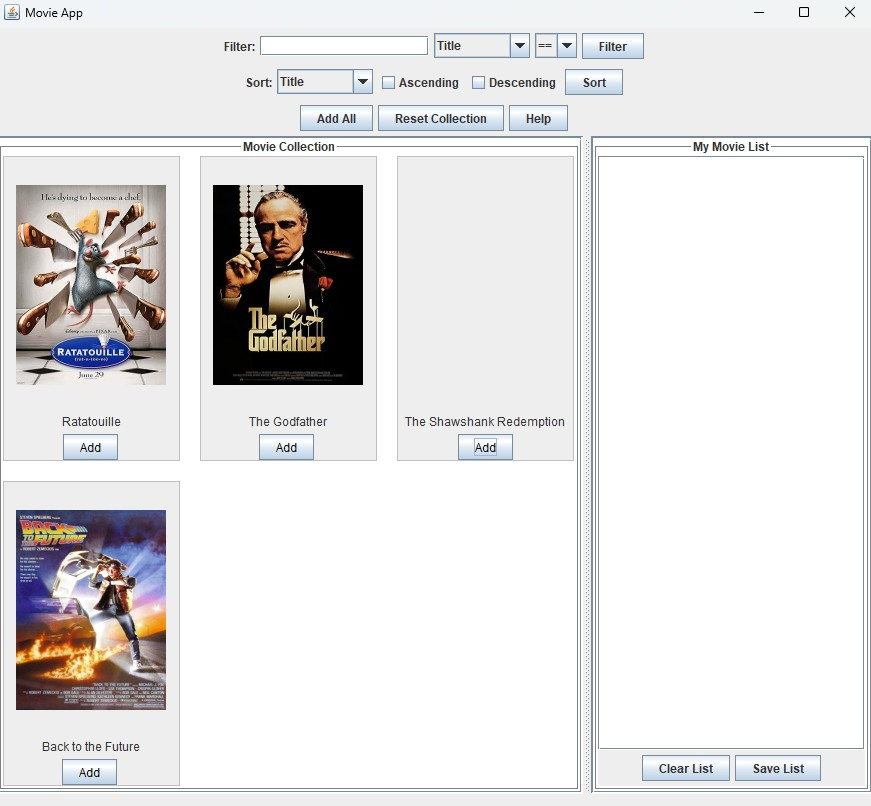

### Connecting the controller and continued testing
After having a basic GUI compiled, it was time to connect the controller and use a smaller list of movies to test the application. The image below shows us testing the filter fuction and sorting the movie collection.  
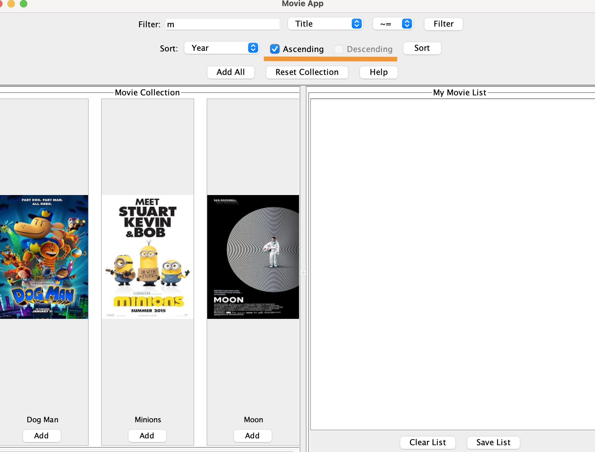
We created error messages to direct the user and tested they popped up at the appropriate times. Such as making sure ascending or descending is selected.  
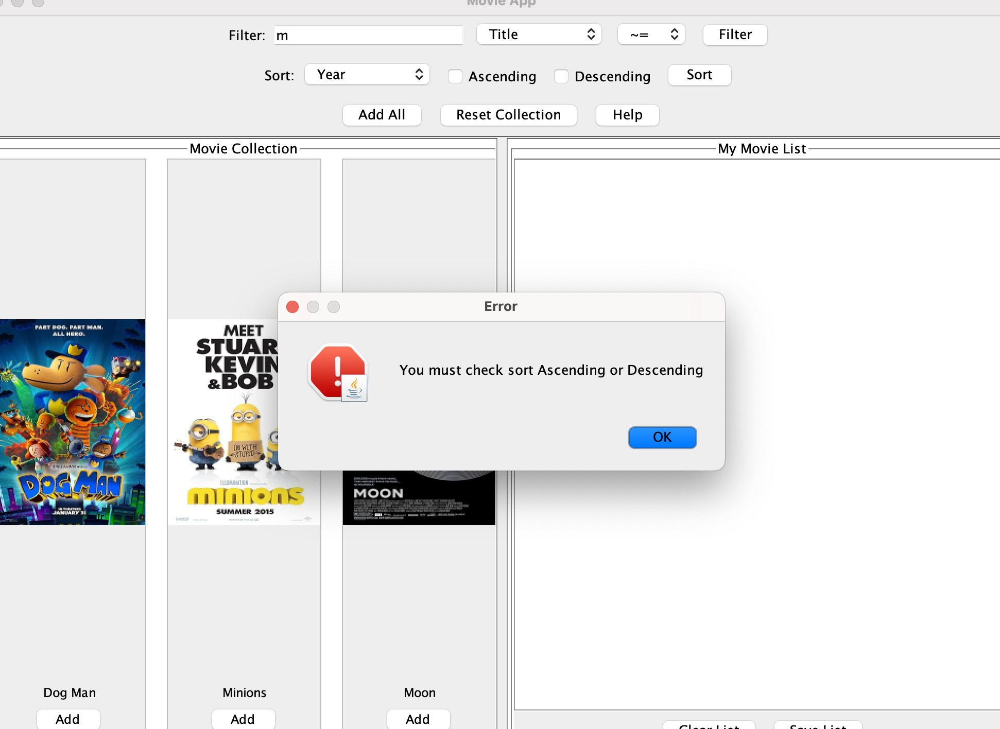
Or that the Movie collection is filtered before sorted.  

This image shows us testing the filter and add button for multiple movies.  
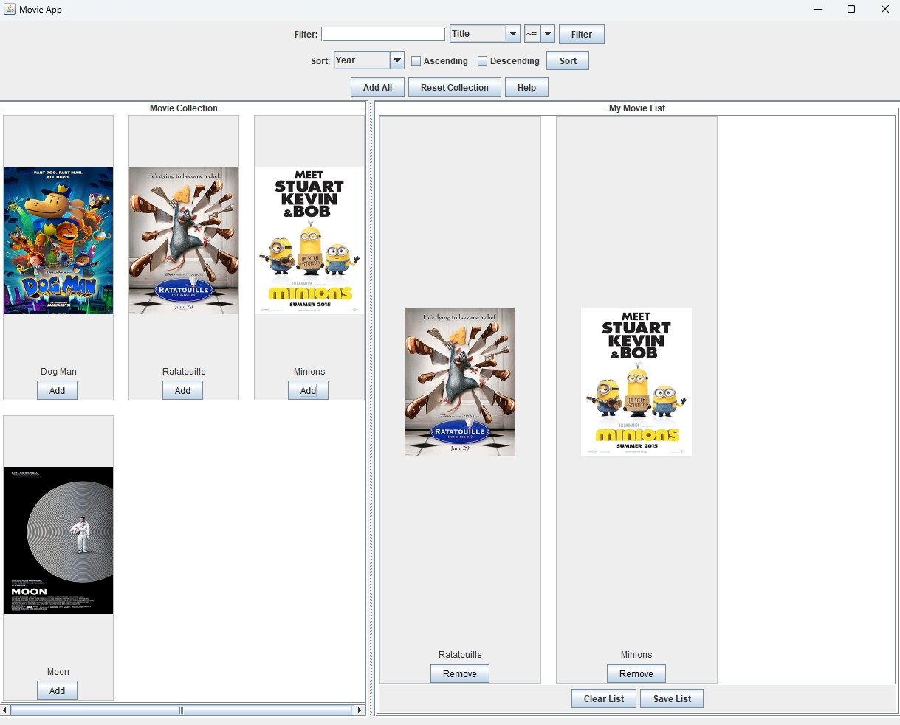
Then we checked the help message pop up to guide users through the experience of using our application. This message was later updated to be more robust and informative for the user.  
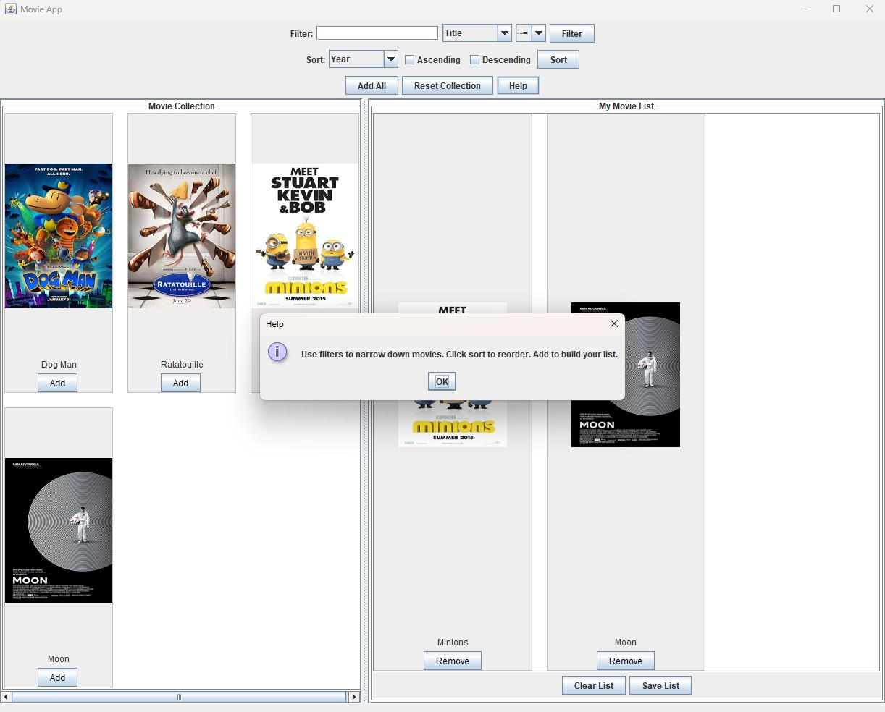

