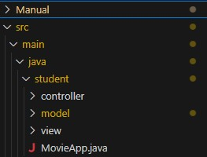
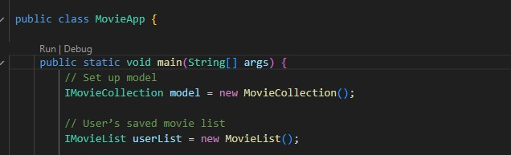
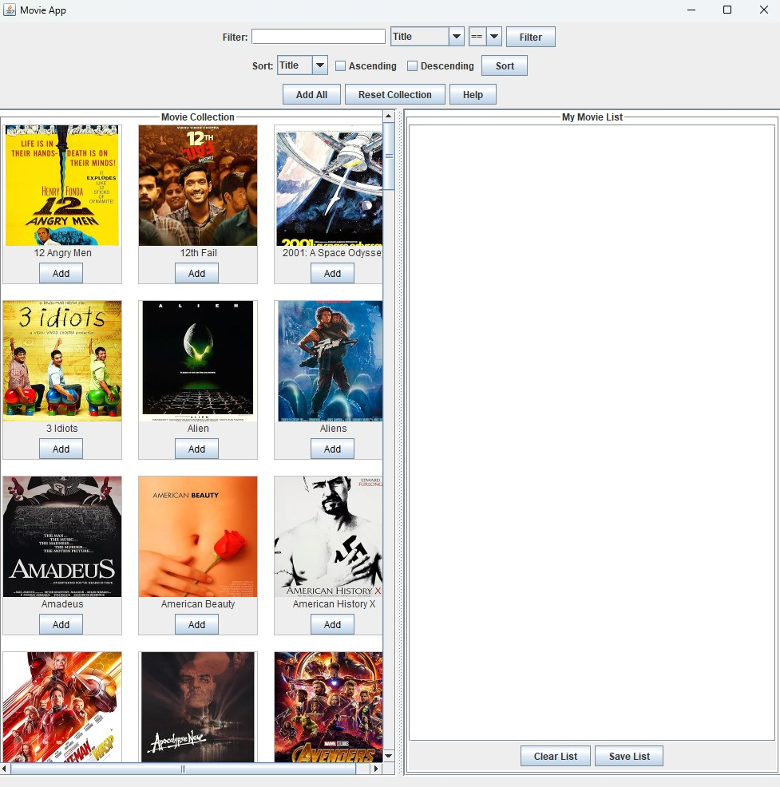
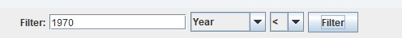
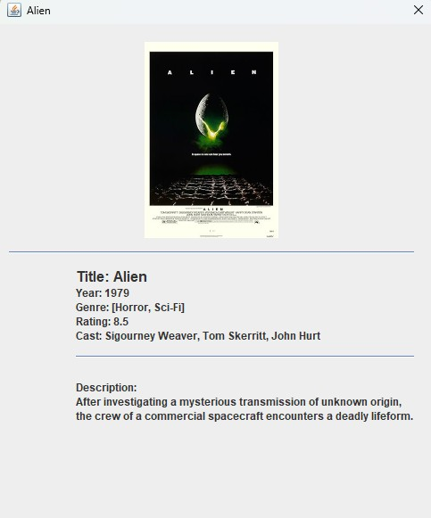

# Movie App Program Manual – 5004 Final Project

### Requirements

Before you begin, please ensure you have the following:

* Java installed (version 8 or above)
* An IDE like IntelliJ or VSCode
* The source code of the project downloaded
  
### Program Introduction
This movie application is a Java program using MVC design artichtecture which allows users to browse, filter, sort, and save movies from a large movie collection to a user movie list. The GUI, created with Swing, displays movies in a visually appealing format with posters, titles, and interactive buttons. Users can filter movies by title, genre, year, and description. The filter results can be sorted by title, rating, or year in ascending or descending order. With the custom button panel, users are able to add all movies to their list, reset the movie collection, or gain insight be using the "help" button. Each movie card includes an "Add" button that lets users build a personalized list in the right panel titled "My Movie List." In the separate "my movie list" panel users are able to remove individual titles by clicking the "Remove" button as well as clear the entire list using "Clear List", or save the list to a file using "Save to File". 

### Features Implmented
Our Movie Program includes the following features:
* Graphical User Interface
* Ability to view entire Movie Collection in ascending order by title
* Ability to build a Movie List from the Movie Collection
* Ability to save the Movie List to a JSON file 
* Ability to search the Movie Collection and API by title
* Ability to filter the Movie Collection by title, genre, year, and description
* Ability to sort the filtered movies by title, rating, or year in ascending or descending order
* Use of OMDB API for the Movie Collection 
* Visible images (movie posters) for each Movie object

### How to run the program

 From the IDE: 

1. Open the project folder in your IDE.
2. Locate the main class file [MovieApp.java](../src/main/java/student/MovieApp.java) 
3. Click the **Run** above `public static void main(String[] args)`.
4. The GUI should launch. 

### Getting Started

The application's purpose is to allow the user to browse and filter a movie collection by title, year, genre, or description and then create their own movie list to save to a file. 
When the GUI lanches you will see:
1. A searh bar and filter button at the top
2. A large movie collection will display on the left
3. An empty "My Movie List" panel on the right.
4. Functional buttons along the top and bottom of the program frame. 

### Filtering Movies
The application allows the user to narrow down the movie collection for easier browsing by filtering.
1. Type into the filter field to search by:
* Title
* Genre
* Year
* Description
2. Use the dropdown menu to select the filter parameter and an operator:
* `==` (equals)
* `!=` (does not equal)
* `>` (greater than)
* `<`  (less than)
* `>=` (greater than or equal to)
* `<=` (less than or equal to)
* `~=`  (contains)
3. Click the filter button to apply your filter

### Sorting Movies
The user may apply the sort function to the movie collection after it has been filtered. Note: The movie collection will automatically be sorted by title.
1. Use the sort dropdown menu to select the sort parameter (title, year, or rating)
2. Select Ascending or Decending order
3. click the Sort button

### Movie Collection (Left Panel)
* The movie collection is displayed in the left panel
* The movies are displayed as cards with the movie poster images and titles.
* Click on the movie poster to display the full movie card.
* Click the Add button on any card to move that movie to your personal movie list on the right. 

### My Movie List (Right Panel)
* The panel of the right is your personalized movie list. 
* Movies you add appear in the same card format as the movie collection.
* Click the Remove button at any time to remove a movie from your movie list. 
* You may add as many movies as you would like to My Movie List. As it grows, scroll through it. 
* If you would like to start over, click clear list to remove all movies. 

### Individual Movie Cards
Every movie in the movie collection has a movie card with additional information outside of the filtering parameters. To access the movie card click on the movie poster in the movie collection or movie list. The movie card includes
* Title
* Genre: includes one or multiple applicable genres
* Rating: IMDB rating on a scale of 10
* Cast: leading cast memebers
* Description or plot

### Buttons Explained
* **Add All:** Adds all visible movies in the movie collection to My Movie List. 
* **Reset Collection:** Resets the filters and shows the full movie database again. 
* **Help:** displays a detailed informational help message for users
* **Add:** adds the single movie to My Movie List
* **Remove:** removes a single movie from My Movie List
* **Clear List:** cleans entire Movie List 
* **Save List:** exports the users current Movie List to a JSON file.

### Saving your Movie List
The program allows your to save My Movie List as a local file once you are done browsing. 
* Browse, Filter, Sort the movie collection.
* Add Movies to My Movie List.
* Click Save List to save your list to `userSavedLists.json`.

### Can't find a Movie?
If you can't find a movie you're looking for, don't worry! Our program is using a local file with movie data, and if you can't find what you're looking for simply search for the movie using the Title filter and the data should be fetched from OMDB. 

When you are done creating your Movie List, close the program.  
Thanks for running our program!
