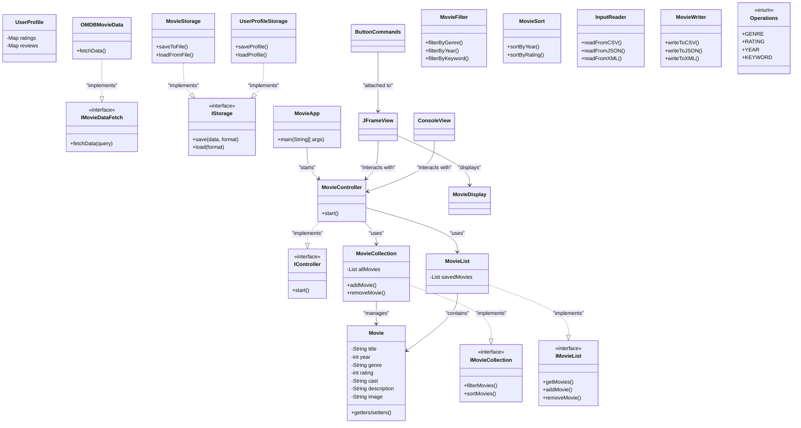

### Java Movie Application - Final Project Proposal  

**1. What are you building?**
   We are building a movie application that fetches movie data from an open API (TBD) and allows the user to search, filter, sort movies through a GUI. We are hoping to build userprofile and storage features so the user cannot only search the database, but also add their own ratings and reviews which can be accessed across different sessions.

**2. What are the initial features for the application?**

  ##### GUI

  1. Search movies component:
      - Includes input field and search button
      - Search by keywords (movie name, genre, etc.)
      - After enter the search button, the UI will display a few (number to be TBD) match movies
      - For each displayed movie, there should be a `button` to save the movie to the `saved movie list`
  
  2. Display saved movies component:
      - a `Saved List` movie button
      - after clicking the saved list button, the UI will render the list of saved movies
  
  3. Movie Details component: (the details each movie should display on the UI)
      - Movie name
      - Release dates
      - Rating
      - genre
  
  4. Sorting/Filtering component
      - Will include buttons/dropdowns to sort the movies by movies, ratings, etc.
      - Will include buttons/dropdowns to filter the movies by genre, rating, etc.

  ##### Basic Features
   - View entire collection of movies
   - Build a list of movies from the larger collection
   - Save the list to a file (CSV, JSON, XML)

**3. What are the minimum additional features you plan to implement?**

   - use an online movie API such as TMBD or OMDB
   - search for specific movies
   - sort movies in ascending or descending order
     - Such as sort the movies in the saved list
   - filter movie list by name, rating, year, genre

**4. What are your stretch goals (features beyond the minimum)?**

   - include images of movie posters upon search
   - allow a user to provide personal movie ratings and reviews that remain persistent across sessions
   - filter items by keywords
   - delete a movie from the saved movie list

**5. Initial design (MVC Architecture)**
   Special emphasis should be placed on how you plan to break it up
   MVC, presenter, file management, different input validation, testing, documentation, etc.

  
   **Main Entry:** `MovieApp`

   **Model:** files to be put in the model package

   - `Movie`, a class to hold movie object details (title, average rating, year, genre, cast, description, and image?) include getter and setter methods
   - `IMovieCollection` interface that sets up initial filters and sorts
   - `MovieCollection` class, manages the entire collection with methods for adding and removing from list
   - `IMovieList` interface for a list of Movie objects
   - `MovieList` class for list of Movie Objects
   - `Operations` or `FilterType` enum for operations that remain constant for filtering
   - `MovieFilter` class, a class with various methods to filter movie data such as filterByGenre, filterByYear, filterByKeyword etc
   - `MovieSort`, a class to sort movie data ascending or ascending. sortByYear, sortByRating etc
   - `IMovieDataFetch` interface, an interface to fetch the data from various APIs (TMBD, OMDB, or another)
   - `OMDBMovieData`, a class that fetches movie data from the specfic API we decide to use
   - `MovieStorage`, a class to load/save the MovieList to multiple file types
   - `IStorage`, interface for saving/loading for both MovieStorage and UserProfileStorage
   - `UserProfile`, a class to create userprofile for Movie ratings and reviews
   - `UserProfileStorage`, a class to save the user profile to a file and retrive it between sessions
   - `InputReader`, a class with method to read saved moives from local xml/csv/json files
   - `MovieWriter`, a class with methods to write movies to local xml/csv/json files

   **Controller:** files to be put in the controller package
   - `MovieController`, connects the model with the view, will have start() to make view visible
   - `IController` interface

   **View:** files to be put in the view package

   - `JFrameView`, a class serves as the main window for this application. This is the class for the graphical user interface using JFrame. Show's search, sort, and filter results and user profile.
   - `MovieDisplay`, a class to display the list of movies, including movie details
   - `ButtonCommands`, a class to define the button listener, such as sorting, searching by keywords, list all saved movies, etc
   - `Console`, a view to use the command line as well as the GUI?

   **Testing:** testing files
   - TestMovie
   - TestMovieList
   - TestMovieCollection
   - TestMovieFilter
   - TestMovieSort
   - TestOMDBMovieDataFetch
   - TestMovieStorage
   - TestUserProfile
   - TestUserProfileStorage
   - TestInputReader
   - TestMovieWriter

Example of Folder Structure: 
```
src/
├── controller/
│   ├── MovieController.java
│   └── IController.java
├── model/
│   ├── Movie.java
│   ├── IMovieCollection.java
│   ├── MovieCollection.java
│   ├── IMovieList.java
│   ├── MovieList.java
│   ├── MovieFilter.java
│   ├── MovieSort.java
│   ├── Operations.java
│   ├── IMovieDataFetch.java
│   ├── OMDBMovieData.java
│   ├── MovieStorage.java
│   ├── IStorage.java
│   ├── UserProfile.java
│   ├── UserProfileStorage.java
│   ├── InputReader.java
│   └── MovieWriter.java
├── view/
│   ├── JFrameView.java
│   ├── MovieDisplay.java
│   ├── ButtonCommands.java
│   └── ConsoleView.java  (optional)
├── MovieApp.java
└── test/
    └── [Test files for each major class]
```

#### Initial UML (draft)


**5.  How do you plan to break up the work?**
   We plan to break up the work by using a github projects template to assign tasks to different group members.
   We will initially divide the tasks evenly by class and testfile.

**6.  What is your teams timeline and major check-in points?**
   Major check-in points will be weekly check ins on Tuesday during our meeting time: 3/25, 4/1, 4/8, 4/15.
   - By 3/25: Proposal and Initial Design Complete
     - finalize features
     - assign tasks
     - decide on API
   - By 4/1: TDD-- Models, API, + storage
     - implmenent Movie and MovieCollection
     - build MovieDataFetch with testing
     - build MovieStorage with testing
     - build userprofile with testing
   - By 4/8: GUI and Controlller
     - build MovieView GUI
     - implement controller, start, search, filter, sort
     - connect GUI to model
   - By 4/15: Final Testing + Debugging
     - testing with API calls
     - testing with search, sort, filter
     - testing file storage
     - testing gui
   - By 4/18: Project Turned in!
     - double check DRY code / java doc comments
     - demo with Albert or TA
